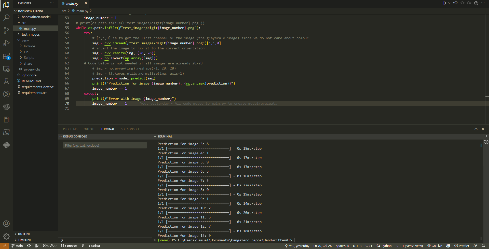

# Handwritten-Recognition-AI

## Demo
CLick here <a href="https://drive.google.com/file/d/16nxT3E8ZA1R6VGddzvHJ3ttSt_BNPO3P/view" target="_blank" rel="noopener">https://drive.google.com/file/d/16nxT3E8ZA1R6VGddzvHJ3ttSt_BNPO3P/view</a>
<br>


<br>

## Intro

This mini project is a handwritten digits recognition tool built using Python and the TensorFlow machine learning library. The program takes in custom images of handwritten digits, processes them, and predicts the corresponding number using a pre-trained neural network model. The project is mainly targeted towards those who are new to machine learning and want to learn the basics of building a simple neural network model for image classification.

<br>

## What I learned

- The basics of machine learning, including supervised learning, neural networks, and image classification.
- How to use Python to preprocess and prepare image data for machine learning models.
- How to use TensorFlow to build and train a neural network model for image classification.
- How to load and use a pre-trained machine learning model for image classification.

<br>

## Why

As a web developer, I wanted to broaden my horizons and learn a new skill in the field of machine learning. I decided to build this mini project to get a basic understanding of how machine learning models work and how they can be used for image classification.

<br>

## Challenges

As someone who is more familiar with JavaScript than Python, there were a few challenges I faced while building this project. Some of the Python syntax and libraries were new to me, and setting up a virtual environment for the project was a bit different from what I was used to with JavaScript projects. However, with some research and practice, I was able to overcome these challenges and complete the project.

<br>

## Technologies Used

- Python
- TensorFlow
- OpenCV
- NumPy
- Matplotlib

<br>

## How to Setup the Project

Clone the project from the GitHub repository with the following command:

```
git clone git@github.com:KangaZero/Handwritten-Recognition-AI.git
```

Create a virtual environment using the following command: 

```
python -m venv [your-venv-name]
```

Activate the virtual environment using the following command: 

```
.\[your-venv-name]\Scripts\activate  
```

Install the required libraries using the following command: 

```
pip install -r requirements.txt
```

<br>

## Run the program

Run the program using the following command from the root of the directory: 

```
python .\src\main.py
```

To ```train a new model```, set the ```train_new_model``` variable in ```main.py``` to ```True``` and run the program again.

To use the program with custom images, add the images to the ```test_images``` directory and name them as ```digit1.png, digit2.png```, and so on. 
Run the program to see the predictions for each image. (Remember to set the ```train_new_model``` variable in ```main.py``` to ```False```)

<br>

```
.-----..-.                .-.             .-.   .---.                 .-. _             
`-. .-': :                : :.-.         .'.'   : .; :                : ::_;            
  : :  : `-.  .--.  ,-.,-.: `'.' .--.   .'.'_   :   .' .--.  .--.   .-' :.-.,-.,-. .--. 
  : :  : .. :' .; ; : ,. :: . `.`._-.'  :_ ` :  : :.`.' '_.'' .; ; ' .; :: :: ,. :' .; :
  :_;  :_;:_;`.__,_;:_;:_;:_;:_;`.__.'    :_:   :_;:_;`.__.'`.__,_;`.__.':_;:_;:_;`._. ;
                                                                                   .-. :
                                                                                   `._.'
```
